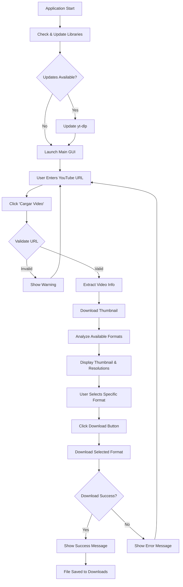
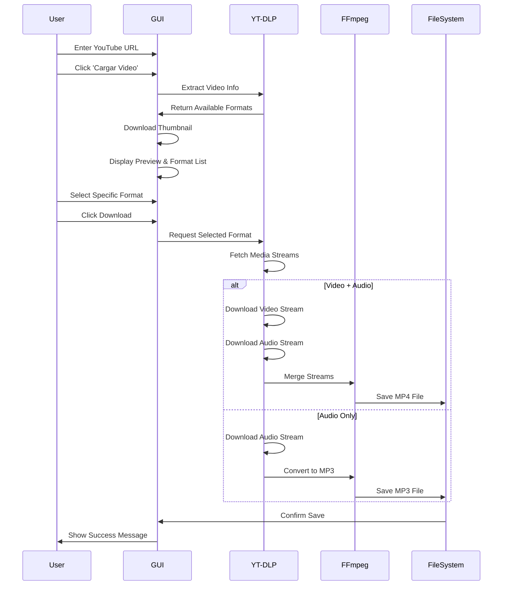
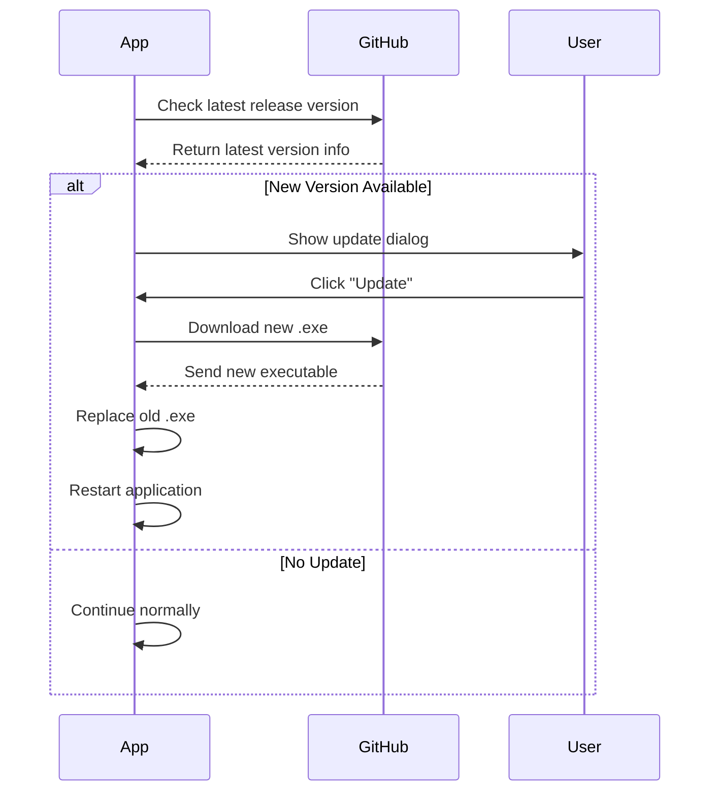
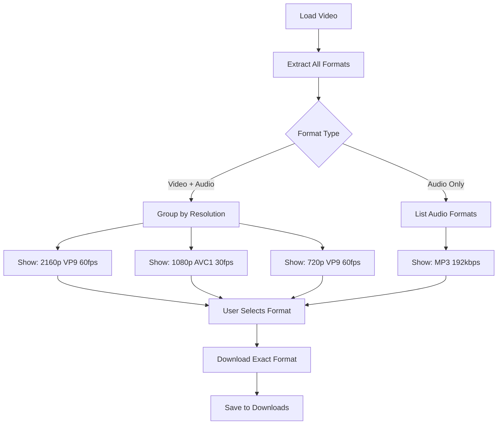
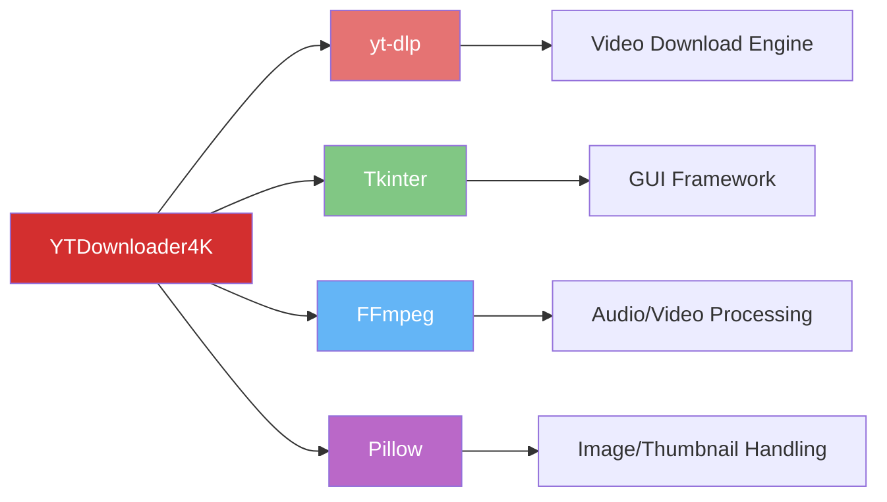

# 🎥 YTDownloader4K - YouTube Video Downloader

[](https://opensource.org/licenses/MIT)
[](https://www.python.org/downloads/)
[](https://github.com/yt-dlp/yt-dlp)
[](https://github.com/ZabaHD4K/DescargadorYT/releases)

A powerful, user-friendly YouTube video downloader with a graphical interface built with Python. Download videos in multiple qualities or extract audio only - all with a simple, intuitive GUI.


> **🆕 What's New in v1.3.3:**  
> ✅ Barra de progreso en tiempo real durante descarga  
> ✅ Velocidad de descarga (MB/s)  
> ✅ Tiempo estimado restante (formato inteligente)  
> ✅ Indicador visual de procesamiento final  
> 
> [View Full Changelog](CHANGELOG.md)

<div align="center">

## 📥 Quick Download

### **[⬇️ Download YTDownloader4k.exe (Windows)](https://github.com/ZabaHD4K/DescargadorYT/raw/main/YTDownloader4k.exe)**

**✨ No installation required • Works on any Windows PC • Auto-update notifications**

[Download Source Code](#-installation)

</div>

---

## ✨ Features

- � **Smart Resolution Selector**: Load any video and see ALL available resolutions with codec details (VP9, AVC1, etc.)
- 🖼️ **Video Preview**: See the video thumbnail before downloading
- 📊 **Detailed Format Info**: View resolution, codec, and FPS for each available format- 📉 **Real-time Progress**: Download progress bar with speed and ETA- 🎵 **Audio Extraction**: Download and convert to MP3 with high quality
- 🔄 **Auto-Update Notifications**: Alerts you when new versions are available with direct download link
- 💾 **Smart Downloads**: Automatically saves to your Downloads folder with resolution in filename
- 🖥️ **User-Friendly GUI**: Clean, intuitive two-step interface (Load → Select → Download)
- 🌍 **Geo-Bypass**: Attempts to bypass geographical restrictions
- ⚡ **Fast & Reliable**: Powered by yt-dlp with retry mechanisms
- 📦 **Portable & Standalone**: No installation needed - just download and run!
- 🪟 **Universal Windows Support**: Works on Windows 7, 8, 10, and 11 without any dependencies

---

## 📋 Table of Contents

- [How It Works](#-how-it-works)
- [Installation](#-installation)
- [Usage](#-usage)
- [System Requirements](#-system-requirements)
- [Building Executable](#-building-executable)
- [Project Structure](#-project-structure)
- [License](#-license)
- [Contributing](#-contributing)

---

## 🔧 How It Works

### Application Flow Diagram



### Download Process Architecture



### Auto-Update Process



### Dynamic Format Selection Logic



---

## 💻 Installation

### 🪟 Windows Users (Easiest - Recommended)

**No installation required!** Just download and run:

1. **[⬇️ Download YTDownloader4k.exe](https://github.com/ZabaHD4K/DescargadorYT/raw/main/dist/YTDownloader4k.exe)**
2. **Double-click** to run
3. **Start downloading!**

✅ **Everything is included**: Python, yt-dlp, FFmpeg, and all dependencies are bundled inside the executable.  
✅ **Works immediately** on Windows 7/8/10/11 without installing anything.  
✅ **Portable**: Run it from anywhere - USB drive, desktop, or any folder.  
✅ **No admin rights needed**: Works on restricted computers.

---

### 🐍 Advanced: Install from Source

Only for developers or advanced users who want to run from Python source code.

#### Prerequisites

**Note:** These are only needed if running from Python source. The Windows .exe has everything included!

Before installation, ensure you have:

1. **Python 3.7 or higher** installed
2. **FFmpeg** installed on your system

#### Installing FFmpeg

**Windows:**
```powershell
# Using winget
winget install ffmpeg

# Or download from: https://ffmpeg.org/download.html
```

**macOS:**
```bash
brew install ffmpeg
```

**Linux (Ubuntu/Debian):**
```bash
sudo apt update
sudo apt install ffmpeg
```

### Install from Source

1. **Clone the repository:**
```bash
git clone https://github.com/yourusername/YTDownloader4k.git
cd YTDownloader4k
```

2. **Install dependencies:**
```bash
pip install -r requirements.txt
```

3. **Run the application:**
```bash
python descargador.py
```

---

## 🔄 Auto-Update Feature

The application includes **update notification functionality**:

### How It Works

1. **On Startup**: The app checks GitHub's `version.txt` for the latest version
2. **Version Comparison**: Compares your version with the latest available
3. **Update Notification**: If a new version exists, you'll see a dialog with:
   - ✅ **Download Update**: Opens your browser to download the new .exe
   - ⏭️ **Skip**: Continue with current version
4. **Simple Update**: Download the new .exe and replace the old one
5. **Library Updates**: Your dependencies (`yt-dlp`) are also kept up-to-date automatically

### Benefits

- 🔔 **Stay informed** - Know when updates are available
- 🛡️ **Bug fixes** - Get security and stability improvements
- ✨ **New features** - Access the latest functionality
- 📦 **User control** - You decide when to update

**Note**: Update notifications only work with the compiled executable (.exe), not when running from Python source.

---

## 🚀 Usage

### Quick Start (Windows - No Installation Required!)

1. **[Download YTDownloader4k.exe](https://github.com/ZabaHD4K/DescargadorYT/raw/main/dist/YTDownloader4k.exe)**
2. **Double-click** the downloaded file (no installation needed!)
3. **Enter** a YouTube URL and click **"Cargar Video"**
4. **Preview** the video thumbnail and available formats
5. **Select** your desired resolution from the dropdown
6. **Click Download**
7. **Done!** Find your file in the Downloads folder

**That's it!** The app works immediately on any Windows PC without installing Python, FFmpeg, or any dependencies. Everything is included in the single executable.

### Running from Source (Advanced Users)

```bash
python descargador.py
```

### Using the Executable (Windows)

**Quick Download:**
1. **[Click here to download YTDownloader4k.exe](https://github.com/ZabaHD4K/DescargadorYT/raw/main/YTDownloader4k.exe)** directly from this repo
2. Run `YTDownloader4k.exe` - **no installation required!**
3. The app will notify you if updates are available
4. Enter a YouTube URL and click **"Cargar Video"**
5. View the thumbnail and available formats
6. Select your desired resolution
7. Click **Download**
8. Find your file in the **Downloads** folder

**✅ Works on any Windows without installation** - All dependencies are bundled inside the .exe file

### GUI Overview (v1.3.3)

```
┌────────────────────────────────────────────┐
│   YTDownloader4K v1.3.3                    │
│   Descargador de YouTube 4K                │
│                                            │
│   URL del video:                           │
│   ┌──────────────────────────────────────┐ │
│   │ https://youtube.com/watch?v=...      │ │
│   └──────────────────────────────────────┘ │
│                                            │
│          ┌─────────────┐                  │
│          │ Cargar Video│                  │
│          └─────────────┘                  │
│                                            │
│   ┌────────────────────────────────────┐  │
│   │      [Video Thumbnail 160x90]      │  │
│   └────────────────────────────────────┘  │
│                                            │
│   Resolución disponible:                   │
│   ┌──────────────────────────────────────┐ │
│   │ 2160p (vp9, 30fps)                 ▼│ │
│   │ 2160p (av01, 30fps)                  │ │
│   │ 1440p (vp9, 30fps)                   │ │
│   │ 1080p (vp9, 30fps)                   │ │
│   │ 720p (vp9, 30fps)                    │ │
│   │ Solo Audio (MP3)                     │ │
│   └──────────────────────────────────────┘ │
│                                            │
│          ┌─────────────┐                  │
│          │  Descargar  │                  │
│          └─────────────┘                  │
│                                            │
│   ┌──────────────────────────────────────┐ │
│   │█████████████████████████           │ │
│   └──────────────────────────────────────┘ │
│   Descargando: 45.3% | 2.5 MB/s | 1m 23s  │
│                                            │
│   Carpeta: Descargas | Autor: Alejandro   │
│                          Zabaleta          │
└────────────────────────────────────────────┘
```

### Format Selection Guide

| Resolution | Codec Options | FPS Options | File Size (approx) | Use Case |
|------------|---------------|-------------|-------------------|----------|
| **2160p (4K)** | VP9, AV01 | 30 (60 si disponible) | 1-7 GB | Ultra high quality, 4K displays |
| **1440p (2K)** | VP9, AV01 | 30 (60 si disponible) | 500MB-3GB | High quality, gaming/editing |
| **1080p (FHD)** | VP9, AV01, AVC1 | 30 (60 si disponible) | 200MB-1GB | Standard HD, everyday use |
| **720p (HD)** | VP9, AV01, AVC1 | 30 (60 si disponible) | 100-500MB | Balanced quality/size |
| **480p (SD)** | VP9, AV01, AVC1 | 30 | 50-200MB | Lower bandwidth |
| **360p** | AVC1 | 30 | 30-100MB | Mobile/slow connections |
| **240p** | VP9, AV01 | 30 | 20-50MB | Very low bandwidth |
| **144p** | AVC1 | 30 | 10-30MB | Minimal bandwidth |
| **Audio (MP3)** | 192kbps | - | 3-10MB | Music, podcasts |

**🎯 Codec Guide:**
- **VP9**: Google's codec, good compression, wide support
- **AV01**: Newest codec, best compression, smaller files
- **AVC1 (H.264)**: Universal compatibility, larger files

**📹 FPS Note:**
- Most videos are recorded at **30fps** (standard)
- Gaming/sports videos may offer **60fps** for smoother motion
- The app shows exactly what YouTube provides for each specific video

**Note**: Available formats vary by video. The app automatically detects and shows ALL formats available for your specific video, including all codec variants and FPS options.

---

## 🖥️ System Requirements

### For Windows Executable (Recommended)
- **OS**: Windows 7, 8, 10, or 11 (32-bit or 64-bit)
- **RAM**: 512 MB minimum
- **Storage**: 100 MB + space for downloads
- **Internet**: Stable connection required
- **NO INSTALLATION REQUIRED** - Everything is bundled in the .exe

### For Running from Source (Advanced)
- **OS**: Windows 7+, macOS 10.12+, or Linux
- **Python**: 3.7 or higher
- **RAM**: 512 MB
- **Storage**: 100 MB + space for downloads
- **Internet**: Stable connection required

### Recommended Requirements
- **OS**: Windows 10+, macOS 11+, or recent Linux
- **Python**: 3.9 or higher
- **RAM**: 2 GB
- **Storage**: 1 GB + space for downloads

---

## 📦 Building Executable

To create a standalone executable using PyInstaller:

```bash
# Navigate to src folder
cd src

# Install PyInstaller
pip install pyinstaller

# Build the executable
pyinstaller --onefile --windowed --name YTDownloader4k --icon=icon.ico descargador.py

# The executable will be in the 'src/dist' folder
# Copy it to the root
copy dist\YTDownloader4k.exe ..
```

### Build Options Explained

```bash
pyinstaller \
    --onefile \              # Create a single executable file
    --windowed \             # No console window (GUI only)
    --name YTDownloader4k \  # Name of the executable
    --icon=icon.ico \        # Add custom icon
    descargador.py           # Source Python file
```

---

## 📁 Project Structure

```
YTDownloader4k/
├── YTDownloader4k.exe      # ⭐ Ready-to-use executable (download this!)
├── version.txt             # Current version for update checks (1.3.3)
├── README.md               # This file
├── CHANGELOG.md            # Version history and changes
├── .gitignore              # Git ignore rules
└── src/                    # Source code folder
    ├── descargador.py      # Main application source code
    ├── requirements.txt    # Python dependencies (yt-dlp, pillow)
    ├── icon.ico            # Application icon
    ├── YTDownloader4k.spec # PyInstaller configuration
    ├── build/              # Build artifacts (git ignored)
    └── dist/               # Compiled outputs (git ignored)
        └── YTDownloader4k.exe
```

---

## 🔑 Key Technologies

### Core Dependencies



- **[yt-dlp](https://github.com/yt-dlp/yt-dlp)**: Modern YouTube downloader and fork of youtube-dl
- **[Tkinter](https://docs.python.org/3/library/tkinter.html)**: Python's standard GUI library
- **[FFmpeg](https://ffmpeg.org/)**: Multimedia framework for audio/video processing
- **[Pillow](https://python-pillow.org/)**: Python Imaging Library for thumbnail display

---

## 📄 License

This project is **open source** and available under the [MIT License](LICENSE).

```
MIT License

Copyright (c) 2026 Alejandro Zabaleta

Permission is hereby granted, free of charge, to any person obtaining a copy
of this software and associated documentation files (the "Software"), to deal
in the Software without restriction, including without limitation the rights
to use, copy, modify, merge, publish, distribute, sublicense, and/or sell
copies of the Software, and to permit persons to whom the Software is
furnished to do so, subject to the following conditions:

The above copyright notice and this permission notice shall be included in all
copies or substantial portions of the Software.

THE SOFTWARE IS PROVIDED "AS IS", WITHOUT WARRANTY OF ANY KIND, EXPRESS OR
IMPLIED, INCLUDING BUT NOT LIMITED TO THE WARRANTIES OF MERCHANTABILITY,
FITNESS FOR A PARTICULAR PURPOSE AND NONINFRINGEMENT.
```

### 🆓 Free and Open Source

- ✅ **Both the source code and executable are free to use**
- ✅ **Open source** - inspect, modify, and distribute
- ✅ **No restrictions** - use for personal or commercial purposes
- ✅ **Community-driven** - contributions welcome

---

## 🤝 Contributing

Contributions are welcome! Here's how you can help:

### Ways to Contribute

1. 🐛 **Report Bugs**: Open an issue describing the problem
2. 💡 **Suggest Features**: Share your ideas for improvements
3. 🔧 **Submit Pull Requests**: Fix bugs or add features
4. 📖 **Improve Documentation**: Help make the docs clearer
5. 🌍 **Translations**: Add support for more languages

### Development Setup

```bash
# Fork and clone the repository
git clone https://github.com/yourusername/YTDownloader4k.git
cd YTDownloader4k

# Create a virtual environment
python -m venv venv
source venv/bin/activate  # On Windows: venv\Scripts\activate

# Install dependencies
pip install -r requirements.txt

# Make your changes and test
python descargador.py

# Submit a pull request
```

---

## 🐛 Troubleshooting

### Common Issues

#### "FFmpeg not found"
**Solution**: Install FFmpeg as described in the [Installation](#-installation) section.

#### "SSL Certificate Error"
**Solution**: The app automatically uses `nocheckcertificate: True` to handle this.

#### "Video unavailable"
**Solution**: The video might be private, deleted, or geo-restricted. Try using a VPN.

#### Download is slow
**Solution**: This depends on your internet connection and YouTube's servers. The app uses the fastest available method.

---

## � Author

**Alejandro Zabaleta**

Feel free to reach out for questions, suggestions, or collaborations!

---

## �📞 Support

- 📧 **Email**: support@example.com
- 🐛 **Issues**: [GitHub Issues](https://github.com/yourusername/YTDownloader4k/issues)
- 💬 **Discussions**: [GitHub Discussions](https://github.com/yourusername/YTDownloader4k/discussions)

---

## 🌟 Acknowledgments

- Thanks to the [yt-dlp](https://github.com/yt-dlp/yt-dlp) team for the amazing download engine
- Thanks to the [FFmpeg](https://ffmpeg.org/) project for media processing capabilities
- Built with ❤️ by **Alejandro Zabaleta** using Python and Tkinter

---

## 📊 Project Status


---

<div align="center">
  
### ⭐ If you find this project useful, please consider giving it a star!

**Made with ❤️ for the community**

[Report Bug](https://github.com/yourusername/YTDownloader4k/issues) · [Request Feature](https://github.com/yourusername/YTDownloader4k/issues) · [Contribute](https://github.com/yourusername/YTDownloader4k/pulls)

</div>
