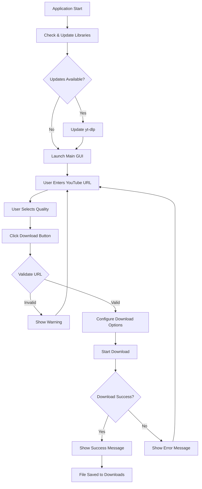
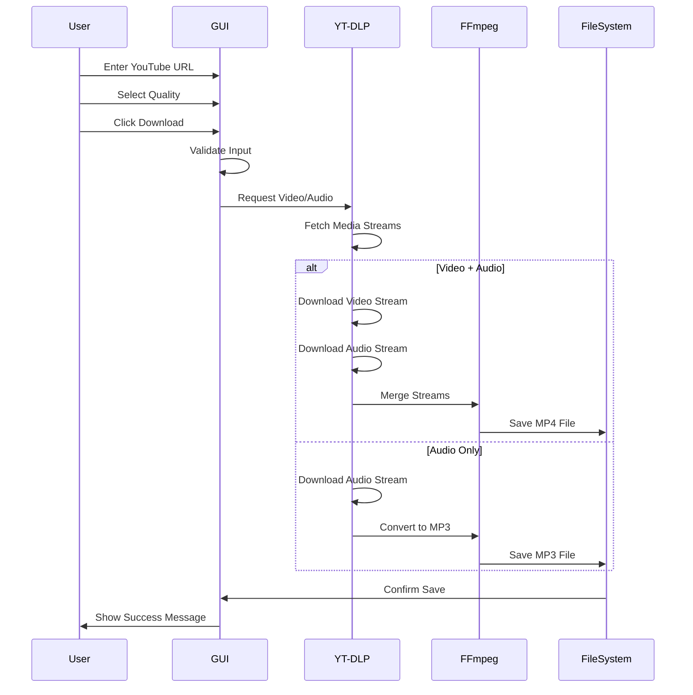
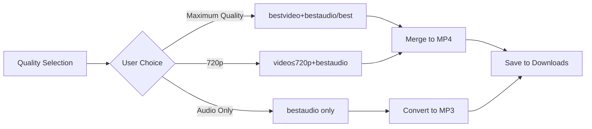
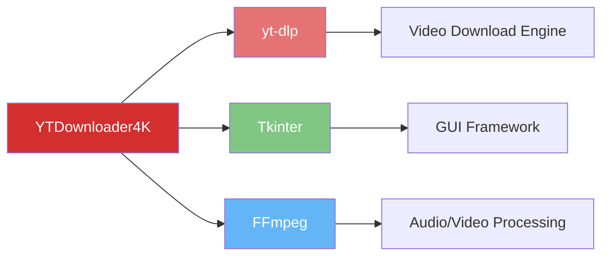

# 🎥 YTDownloader4K - YouTube Video Downloader

[](https://opensource.org/licenses/MIT)
[](https://www.python.org/downloads/)
[](https://github.com/yt-dlp/yt-dlp)

A powerful, user-friendly YouTube video downloader with a graphical interface built with Python. Download videos in multiple qualities or extract audio only - all with a simple, intuitive GUI.


---

## ✨ Features

- 🎬 **Multiple Quality Options**: Maximum quality, 720p, or audio-only (MP3)
- 🎵 **Audio Extraction**: Download and convert to MP3 with high quality
- 🔄 **Auto-Update**: Automatically checks and updates `yt-dlp` library
- 💾 **Smart Downloads**: Automatically saves to your Downloads folder
- 🖥️ **User-Friendly GUI**: Clean, intuitive interface built with Tkinter
- 🌍 **Geo-Bypass**: Attempts to bypass geographical restrictions
- ⚡ **Fast & Reliable**: Powered by yt-dlp with retry mechanisms

---

## 📋 Table of Contents

- [How It Works](#-how-it-works)
- [Installation](#-installation)
- [Usage](#-usage)
- [System Requirements](#-system-requirements)
- [Building Executable](#-building-executable)
- [Project Structure](#-project-structure)
- [License](#-license)
- [Contributing](#-contributing)

---

## 🔧 How It Works

### Application Flow Diagram



### Download Process Architecture



### Quality Selection Logic



---

## 💻 Installation

### Prerequisites

Before installation, ensure you have:

1. **Python 3.7 or higher** installed
2. **FFmpeg** installed on your system

#### Installing FFmpeg

**Windows:**
```powershell
# Using winget
winget install ffmpeg

# Or download from: https://ffmpeg.org/download.html
```

**macOS:**
```bash
brew install ffmpeg
```

**Linux (Ubuntu/Debian):**
```bash
sudo apt update
sudo apt install ffmpeg
```

### Install from Source

1. **Clone the repository:**
```bash
git clone https://github.com/yourusername/YTDownloader4k.git
cd YTDownloader4k
```

2. **Install dependencies:**
```bash
pip install -r requirements.txt
```

3. **Run the application:**
```bash
python descargador.py
```

---

## 🚀 Usage

### Running from Source

```bash
python descargador.py
```

### Using the Executable

1. Download the latest release from the [Releases page](#)
2. Extract the ZIP file
3. Run `YTDownloader4k.exe` (Windows) or the appropriate executable for your OS
4. Enter a YouTube URL
5. Select your desired quality
6. Click **Download**
7. Find your file in the **Downloads** folder

### GUI Overview

```
┌─────────────────────────────────────────┐
│   Descargador de YouTube                │
│                                         │
│   Introduce la URL del video:          │
│   ┌───────────────────────────────────┐ │
│   │ https://youtube.com/watch?v=...   │ │
│   └───────────────────────────────────┘ │
│                                         │
│   Selecciona calidad:                   │
│   ┌───────────────────────────────────┐ │
│   │ Máxima calidad (video + audio)  ▼│ │
│   └───────────────────────────────────┘ │
│                                         │
│          ┌─────────────┐               │
│          │  Descargar  │               │
│          └─────────────┘               │
│                                         │
│   Los archivos se guardarán en tu      │
│   carpeta de Descargas                  │
└─────────────────────────────────────────┘
```

### Quality Options Explained

| Option | Description | File Type | Use Case |
|--------|-------------|-----------|----------|
| **Máxima calidad** | Best available video + audio quality | MP4 | High-quality archival, 4K viewing |
| **720p** | 720p video + high-quality audio | MP4 | Balanced quality/size, everyday use |
| **Solo audio (MP3)** | Audio only, converted to MP3 | MP3 | Music, podcasts, audio-only content |

---

## 🖥️ System Requirements

### Minimum Requirements
- **OS**: Windows 7+, macOS 10.12+, or Linux
- **Python**: 3.7 or higher
- **RAM**: 512 MB
- **Storage**: 100 MB + space for downloads
- **Internet**: Stable connection required

### Recommended Requirements
- **OS**: Windows 10+, macOS 11+, or recent Linux
- **Python**: 3.9 or higher
- **RAM**: 2 GB
- **Storage**: 1 GB + space for downloads

---

## 📦 Building Executable

To create a standalone executable using PyInstaller:

```bash
# Install PyInstaller
pip install pyinstaller

# Build the executable
pyinstaller --onefile --windowed --name YTDownloader4k descargador.py

# The executable will be in the 'dist' folder
```

### Build Options Explained

```bash
pyinstaller \
    --onefile \              # Create a single executable file
    --windowed \             # No console window (GUI only)
    --name YTDownloader4k \  # Name of the executable
    --icon=icon.ico \        # (Optional) Add custom icon
    descargador.py           # Source Python file
```

---

## 📁 Project Structure

```
YTDownloader4k/
├── descargador.py          # Main application source code
├── requirements.txt        # Python dependencies
├── YTDownloader4k.spec     # PyInstaller configuration
├── README.md               # This file
├── __pycache__/            # Python cache files
├── build/                  # Build artifacts (PyInstaller)
│   └── YTDownloader4k/
│       ├── Analysis-00.toc
│       ├── EXE-00.toc
│       ├── PKG-00.toc
│       ├── PYZ-00.pyz
│       ├── PYZ-00.toc
│       ├── warn-YTDownloader4k.txt
│       ├── xref-YTDownloader4k.html
│       └── localpycs/
└── dist/                   # Compiled executable (after build)
    └── YTDownloader4k.exe
```

---

## 🔑 Key Technologies

### Core Dependencies



- **[yt-dlp](https://github.com/yt-dlp/yt-dlp)**: Modern YouTube downloader and fork of youtube-dl
- **[Tkinter](https://docs.python.org/3/library/tkinter.html)**: Python's standard GUI library
- **[FFmpeg](https://ffmpeg.org/)**: Multimedia framework for audio/video processing

---

## 📄 License

This project is **open source** and available under the [MIT License](LICENSE).

```
MIT License

Copyright (c) 2026 Alejandro Zabaleta

Permission is hereby granted, free of charge, to any person obtaining a copy
of this software and associated documentation files (the "Software"), to deal
in the Software without restriction, including without limitation the rights
to use, copy, modify, merge, publish, distribute, sublicense, and/or sell
copies of the Software, and to permit persons to whom the Software is
furnished to do so, subject to the following conditions:

The above copyright notice and this permission notice shall be included in all
copies or substantial portions of the Software.

THE SOFTWARE IS PROVIDED "AS IS", WITHOUT WARRANTY OF ANY KIND, EXPRESS OR
IMPLIED, INCLUDING BUT NOT LIMITED TO THE WARRANTIES OF MERCHANTABILITY,
FITNESS FOR A PARTICULAR PURPOSE AND NONINFRINGEMENT.
```

### 🆓 Free and Open Source

- ✅ **Both the source code and executable are free to use**
- ✅ **Open source** - inspect, modify, and distribute
- ✅ **No restrictions** - use for personal or commercial purposes
- ✅ **Community-driven** - contributions welcome

---

## 🤝 Contributing

Contributions are welcome! Here's how you can help:

### Ways to Contribute

1. 🐛 **Report Bugs**: Open an issue describing the problem
2. 💡 **Suggest Features**: Share your ideas for improvements
3. 🔧 **Submit Pull Requests**: Fix bugs or add features
4. 📖 **Improve Documentation**: Help make the docs clearer
5. 🌍 **Translations**: Add support for more languages

### Development Setup

```bash
# Fork and clone the repository
git clone https://github.com/yourusername/YTDownloader4k.git
cd YTDownloader4k

# Create a virtual environment
python -m venv venv
source venv/bin/activate  # On Windows: venv\Scripts\activate

# Install dependencies
pip install -r requirements.txt

# Make your changes and test
python descargador.py

# Submit a pull request
```

---

## 🐛 Troubleshooting

### Common Issues

#### "FFmpeg not found"
**Solution**: Install FFmpeg as described in the [Installation](#-installation) section.

#### "SSL Certificate Error"
**Solution**: The app automatically uses `nocheckcertificate: True` to handle this.

#### "Video unavailable"
**Solution**: The video might be private, deleted, or geo-restricted. Try using a VPN.

#### Download is slow
**Solution**: This depends on your internet connection and YouTube's servers. The app uses the fastest available method.

---

## � Author

**Alejandro Zabaleta**

Feel free to reach out for questions, suggestions, or collaborations!

---

## �📞 Support

- 📧 **Email**: support@example.com
- 🐛 **Issues**: [GitHub Issues](https://github.com/yourusername/YTDownloader4k/issues)
- 💬 **Discussions**: [GitHub Discussions](https://github.com/yourusername/YTDownloader4k/discussions)

---

## 🌟 Acknowledgments

- Thanks to the [yt-dlp](https://github.com/yt-dlp/yt-dlp) team for the amazing download engine
- Thanks to the [FFmpeg](https://ffmpeg.org/) project for media processing capabilities
- Built with ❤️ by **Alejandro Zabaleta** using Python and Tkinter

---

## 📊 Project Status


---

<div align="center">
  
### ⭐ If you find this project useful, please consider giving it a star!

**Made with ❤️ for the community**

[Report Bug](https://github.com/yourusername/YTDownloader4k/issues) · [Request Feature](https://github.com/yourusername/YTDownloader4k/issues) · [Contribute](https://github.com/yourusername/YTDownloader4k/pulls)

</div>
