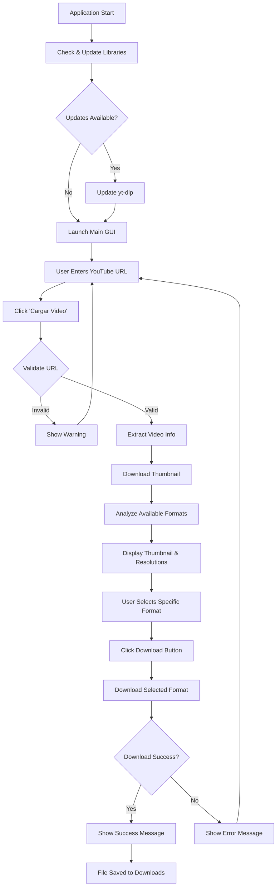
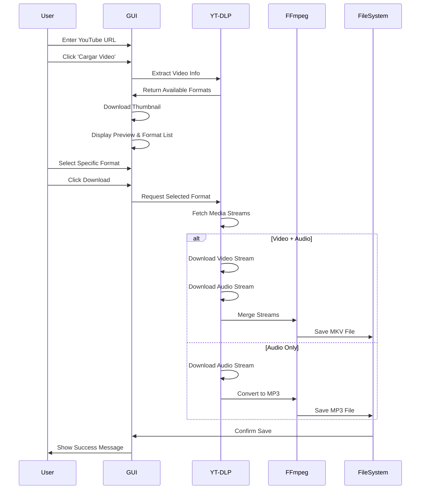
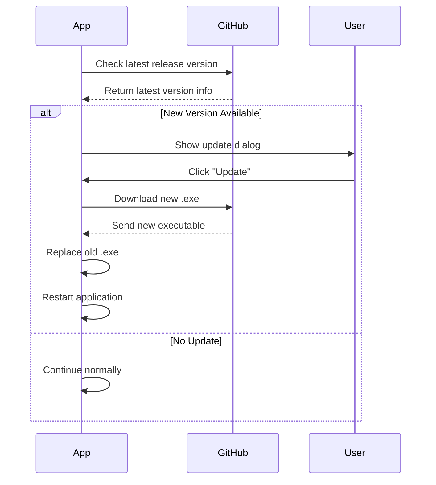
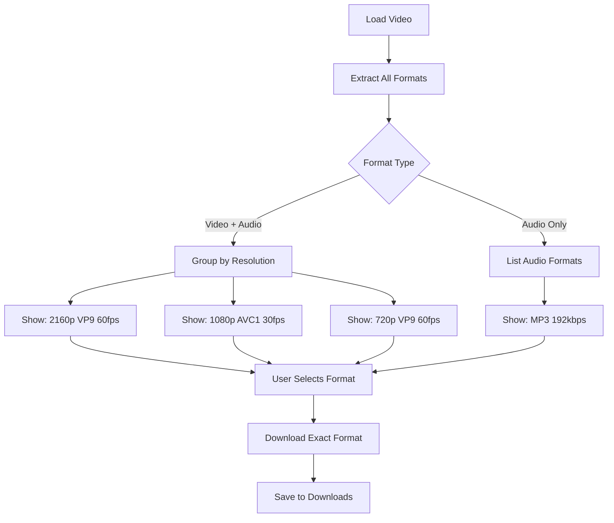
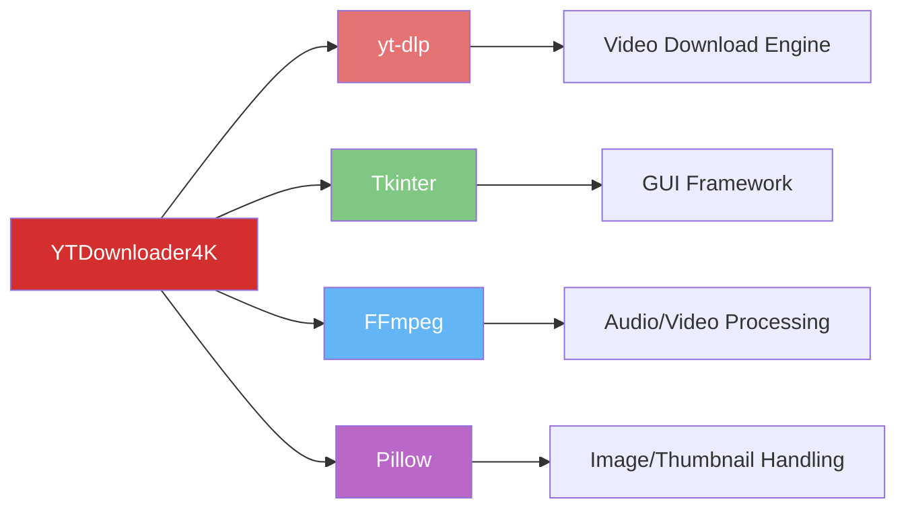

# 🎥 YTDownloader4K - YouTube Video Downloader

[](https://opensource.org/licenses/MIT)
[](https://www.python.org/downloads/)
[](https://github.com/yt-dlp/yt-dlp)
[](https://github.com/ZabaHD4K/DescargadorYT/releases/latest)

A powerful, user-friendly YouTube video downloader with a graphical interface built with Python. Download videos in multiple qualities or extract audio only - all with a simple, intuitive GUI.


> **🆕 What's New in v1.7.4:**
> ✅ **Updated internals** — rebuilt with the latest build toolchain and bundled libraries
> ✅ **Seamless in-place auto-update** — the app downloads the new version and replaces itself automatically, no manual steps
> ✅ **Cleaner updates** — update temp files now live in `%TEMP%`, so nothing is left on your desktop
> ✅ **Antivirus/EDR-friendly relaunch** — the updated app restarts via Explorer, avoiding security warnings
> ✅ **Hardened downloads** — update integrity is verified against the exact server-reported size
> ✅ **Distribution via GitHub Releases** — new versions are built and published automatically by CI
> ✅ Previous fixes: HLS/MKV merge fix, HDR detection, full resolution coverage up to 4K
>
> [View Full Changelog](CHANGELOG.md)

<div align="center">

## 📥 Quick Download

### **[⬇️ Download YTDownloader4k.exe (Windows)](https://github.com/ZabaHD4K/DescargadorYT/releases/latest/download/YTDownloader4k.exe)**

**✨ No installation required • Works on any Windows PC • Auto-update notifications**

[Download Source Code](#-installation)

</div>

---

## ✨ Features

- 🎯 **Smart Resolution Selector**: Load any video and see ALL available resolutions with codec details (VP9, AVC1, etc.)
- 🖼️ **Video Preview**: See the video thumbnail before downloading
- 📊 **Detailed Format Info**: View resolution, codec, and FPS for each available format
- 📉 **Real-time Progress**: Download progress bar with speed and ETA
- 🎵 **Audio Extraction**: Download and convert to MP3 with high quality
- 🔄 **Auto-Update**: Downloads and installs new versions in place — one click and the app restarts updated
- 💾 **Smart Downloads**: Automatically saves to your Downloads folder with resolution in filename
- 🖥️ **User-Friendly GUI**: Clean, intuitive two-step interface (Load → Select → Download)
- 🌍 **Geo-Bypass**: Attempts to bypass geographical restrictions
- ⚡ **Fast & Reliable**: Powered by yt-dlp with retry mechanisms
- 📦 **Portable & Standalone**: No installation needed - just download and run!
- 🪟 **Universal Windows Support**: Works on Windows 7, 8, 10, and 11 without any dependencies

---

## 📋 Table of Contents

- [How It Works](#-how-it-works)
- [Installation](#-installation)
- [Usage](#-usage)
- [System Requirements](#-system-requirements)
- [Building Executable](#-building-executable)
- [Project Structure](#-project-structure)
- [License](#-license)
- [Contributing](#-contributing)

---

## 🔧 How It Works

### Application Flow Diagram


```mermaid
graph TD
    A[Application Start] --> B[Check & Update Libraries]
    B --> C{Updates Available?}
    C -->|Yes| D[Update yt-dlp]
    C -->|No| E[Launch Main GUI]
    D --> E
    E --> F[User Enters YouTube URL]
    F --> G[Click 'Cargar Video']
    G --> H{Validate URL}
    H -->|Invalid| I[Show Warning]
    H -->|Valid| J[Extract Video Info]
    J --> K[Download Thumbnail]
    K --> L[Analyze Available Formats]
    L --> M[Display Thumbnail & Resolutions]
    M --> N[User Selects Specific Format]
    N --> O[Click Download Button]
    O --> P[Download Selected Format]
    P --> Q{Download Success?}
    Q -->|Yes| R[Show Success Message]
    Q -->|No| S[Show Error Message]
    I --> F
    R --> T[File Saved to Downloads]
    S --> F
```

### Download Process Architecture


```mermaid
sequenceDiagram
    participant User
    participant GUI
    participant YT-DLP
    participant FFmpeg
    participant FileSystem

    User->>GUI: Enter YouTube URL
    User->>GUI: Click 'Cargar Video'
    GUI->>YT-DLP: Extract Video Info
    YT-DLP->>GUI: Return Available Formats
    GUI->>GUI: Download Thumbnail
    GUI->>GUI: Display Preview & Format List
    User->>GUI: Select Specific Format
    User->>GUI: Click Download
    GUI->>YT-DLP: Request Selected Format
    YT-DLP->>YT-DLP: Fetch Media Streams
    
    alt Video + Audio
        YT-DLP->>YT-DLP: Download Video Stream
        YT-DLP->>YT-DLP: Download Audio Stream
        YT-DLP->>FFmpeg: Merge Streams
        FFmpeg->>FileSystem: Save MKV File
    else Audio Only
        YT-DLP->>YT-DLP: Download Audio Stream
        YT-DLP->>FFmpeg: Convert to MP3
        FFmpeg->>FileSystem: Save MP3 File
    end
    
    FileSystem->>GUI: Confirm Save
    GUI->>User: Show Success Message
```

### Auto-Update Process


```mermaid
sequenceDiagram
    participant App
    participant GitHub
    participant User

    App->>GitHub: Check latest release version
    GitHub-->>App: Return latest version info
    
    alt New Version Available
        App->>User: Show update dialog
        User->>App: Click "Update"
        App->>GitHub: Download new .exe
        GitHub-->>App: Send new executable
        App->>App: Replace old .exe
        App->>App: Restart application
    else No Update
        App->>App: Continue normally
    end
```

### Dynamic Format Selection Logic


```mermaid
flowchart TD
    A[Load Video] --> B[Extract All Formats]
    B --> C{Format Type}
    
    C -->|Video + Audio| D[Group by Resolution]
    C -->|Audio Only| E[List Audio Formats]
    
    D --> F[Show: 2160p VP9 60fps]
    D --> G[Show: 1080p AVC1 30fps]
    D --> H[Show: 720p VP9 60fps]
    
    E --> I[Show: MP3 192kbps]
    
    F --> J[User Selects Format]
    G --> J
    H --> J
    I --> J
    
    J --> K[Download Exact Format]
    K --> L[Save to Downloads]
```

---

## 💻 Installation

### 🪟 Windows Users (Easiest - Recommended)

**No installation required!** Just download and run:

1. **[⬇️ Download YTDownloader4k.exe](https://github.com/ZabaHD4K/DescargadorYT/releases/latest/download/YTDownloader4k.exe)**
2. **Double-click** to run
3. **Start downloading!**

✅ **Everything is included**: Python, yt-dlp, and all dependencies are bundled inside the executable. FFmpeg is downloaded automatically on first run (one-time setup).  
✅ **Works immediately** on Windows 10/11 without installing anything.  
✅ **Portable**: Run it from anywhere - USB drive, desktop, or any folder.  
✅ **No admin rights needed**: Works on restricted computers.

---

### 🐍 Advanced: Install from Source

Only for developers or advanced users who want to run from Python source code.

#### Prerequisites

**Note:** These are only needed if running from Python source. The Windows .exe has everything included!

Before installation, ensure you have:

1. **Python 3.9 or higher** installed
2. **FFmpeg** installed on your system

#### Installing FFmpeg

**Windows:**
```powershell
# Using winget
winget install ffmpeg

# Or download from: https://ffmpeg.org/download.html
```

**macOS:**
```bash
brew install ffmpeg
```

**Linux (Ubuntu/Debian):**
```bash
sudo apt update
sudo apt install ffmpeg
```

### Install from Source

1. **Clone the repository:**
```bash
git clone https://github.com/ZabaHD4K/DescargadorYT.git
cd DescargadorYT
```

2. **Install dependencies:**
```bash
pip install -r src/requirements.txt
```

3. **Run the application:**
```bash
python src/descargador.py
```

---

## 🔄 Auto-Update Feature

The application **updates itself in place** — no manual download needed:

### How It Works

1. **On Startup**: The app queries the GitHub Releases API for the latest version
2. **Version Comparison**: Compares your version with the latest release (semantic versioning — only strictly newer versions trigger an update)
3. **Update Dialog**: If a new version exists, you'll see a dialog with:
   - ✅ **Update Now**: Downloads the new .exe, verifies its integrity, replaces the running app in place, and restarts it automatically
   - ⏭️ **Skip**: Continue with current version
4. **Safe by design**: The download is verified against the exact server-reported size, and the old exe is kept as a backup until the swap succeeds — if anything fails, the previous version is restored

### Benefits

- 🔁 **One-click updates** - The app replaces and restarts itself; same file, same location
- 🛡️ **Bug fixes** - Get security and stability improvements
- ✨ **New features** - Access the latest functionality
- 📦 **User control** - You decide when to update

**Note**: Auto-update only works with the compiled executable (.exe). When running from Python source, the app instead keeps its libraries (`yt-dlp`, `Pillow`) up to date via pip.

---

## 🚀 Usage

### Quick Start (Windows - No Installation Required!)

1. **[Download YTDownloader4k.exe](https://github.com/ZabaHD4K/DescargadorYT/releases/latest/download/YTDownloader4k.exe)**
2. **Double-click** the downloaded file (no installation needed!)
3. **Enter** a YouTube URL and click **"Cargar Video"**
4. **Preview** the video thumbnail and available formats
5. **Select** your desired resolution from the dropdown
6. **Click Download**
7. **Done!** Find your file in the Downloads folder

**That's it!** The app works immediately on any Windows PC without installing Python or any dependencies. FFmpeg is fetched automatically on first run.

### Running from Source (Advanced Users)

```bash
python src/descargador.py
```

### Using the Executable (Windows)

**Quick Download:**
1. **[Click here to download YTDownloader4k.exe](https://github.com/ZabaHD4K/DescargadorYT/releases/latest/download/YTDownloader4k.exe)** from the latest GitHub Release
2. Run `YTDownloader4k.exe` - **no installation required!**
3. The app will offer to auto-update itself when a new version is available
4. Enter a YouTube URL and click **"Load Video"**
5. View the thumbnail and available formats
6. Select your desired resolution
7. Click **Download**
8. Find your file in the **Downloads** folder

**✅ Works on any Windows without installation** - All dependencies are bundled inside the .exe file (FFmpeg downloads itself on first run)

### GUI Overview

```
┌────────────────────────────────────────────┐
│   YTDownloader4K v1.7.4                    │
│   YouTube 4K Downloader                    │
│                                            │
│   Video URL:                               │
│   ┌──────────────────────────────────────┐ │
│   │ https://youtube.com/watch?v=...      │ │
│   └──────────────────────────────────────┘ │
│                                            │
│          ┌─────────────┐                  │
│          │ Load Video  │                  │
│          └─────────────┘                  │
│                                            │
│   ┌────────────────────────────────────┐  │
│   │      [Video Thumbnail 160x90]      │  │
│   └────────────────────────────────────┘  │
│                                            │
│   Available resolution:                    │
│   ┌──────────────────────────────────────┐ │
│   │ 2160p (vp9, 30fps)                 ▼│ │
│   │ 2160p (av01, 30fps)                  │ │
│   │ 1440p (vp9, 30fps)                   │ │
│   │ 1080p (vp9, 30fps)                   │ │
│   │ 720p (vp9, 30fps)                    │ │
│   │ Audio Only (MP3)                     │ │
│   └──────────────────────────────────────┘ │
│                                            │
│          ┌─────────────┐                  │
│          │  Download   │                  │
│          └─────────────┘                  │
│                                            │
│   ┌──────────────────────────────────────┐ │
│   │█████████████████████████           │ │
│   └──────────────────────────────────────┘ │
│   Downloading: 45.3% | 2.5 MB/s | 1m 23s  │
│                                            │
│   Folder: Downloads | Author: Alejandro   │
│                          Zabaleta          │
└────────────────────────────────────────────┘
```

### Format Selection Guide

| Resolution | Codec Options | FPS Options | File Size (approx) | Use Case |
|------------|---------------|-------------|-------------------|----------|
| **2160p (4K)** | VP9, AV01 | 30 (60 if available) | 1-7 GB | Ultra high quality, 4K displays |
| **1440p (2K)** | VP9, AV01 | 30 (60 if available) | 500MB-3GB | High quality, gaming/editing |
| **1080p (FHD)** | VP9, AV01, AVC1 | 30 (60 if available) | 200MB-1GB | Standard HD, everyday use |
| **720p (HD)** | VP9, AV01, AVC1 | 30 (60 if available) | 100-500MB | Balanced quality/size |
| **480p (SD)** | VP9, AV01, AVC1 | 30 | 50-200MB | Lower bandwidth |
| **360p** | AVC1 | 30 | 30-100MB | Mobile/slow connections |
| **240p** | VP9, AV01 | 30 | 20-50MB | Very low bandwidth |
| **144p** | AVC1 | 30 | 10-30MB | Minimal bandwidth |
| **Audio (MP3)** | 192kbps | - | 3-10MB | Music, podcasts |

**🎯 Codec Guide:**
- **VP9**: Google's codec, good compression, wide support
- **AV01**: Newest codec, best compression, smaller files
- **AVC1 (H.264)**: Universal compatibility, larger files

**📹 FPS Note:**
- Most videos are recorded at **30fps** (standard)
- Gaming/sports videos may offer **60fps** for smoother motion
- The app shows exactly what YouTube provides for each specific video

**Note**: Available formats vary by video. The app automatically detects and shows ALL formats available for your specific video, including all codec variants and FPS options.

---

## 🖥️ System Requirements

### For Windows Executable (Recommended)
- **OS**: Windows 10 or 11 (64-bit)
- **RAM**: 512 MB minimum
- **Storage**: 200 MB + space for downloads (includes the one-time FFmpeg download)
- **Internet**: Stable connection required
- **NO INSTALLATION REQUIRED** - Everything is bundled in the .exe

### For Running from Source (Advanced)
- **OS**: Windows 10+, macOS 10.15+, or Linux
- **Python**: 3.9 or higher (yt-dlp requirement)
- **RAM**: 512 MB
- **Storage**: 100 MB + space for downloads
- **Internet**: Stable connection required

### Recommended Requirements
- **OS**: Windows 10+, macOS 11+, or recent Linux
- **Python**: 3.9 or higher
- **RAM**: 2 GB
- **Storage**: 1 GB + space for downloads

---

## 📦 Building Executable

Official releases are built automatically by GitHub Actions: pushing a `vX.Y.Z` tag runs the tests, builds the exe with PyInstaller, and publishes it as a [GitHub Release](https://github.com/ZabaHD4K/DescargadorYT/releases) asset.

To build locally:

```bash
# Navigate to src folder
cd src

# Install PyInstaller
pip install pyinstaller

# Build using the project's spec file (onefile, windowed, custom icon, UPX)
pyinstaller YTDownloader4k.spec

# The executable will be in the 'src/dist' folder
```

---

## 📁 Project Structure

```
DescargadorYT/
├── YTDownloader4k.exe      # Executable (compat copy; prefer the Releases download)
├── version.txt             # Version file for pre-1.7.0 update checks
├── README.md               # This file
├── CHANGELOG.md            # Version history and changes
├── .github/workflows/
│   └── release.yml         # CI: builds and publishes the exe on version tags
├── src/                    # Source code folder
│   ├── descargador.py      # Main application source code
│   ├── formatos.py         # Format-selection logic (pure, unit-tested)
│   ├── requirements.txt    # Python dependencies (yt-dlp, pillow)
│   ├── icon.ico            # Application icon
│   ├── YTDownloader4k.spec # PyInstaller configuration
│   ├── build/              # Build artifacts (git ignored)
│   └── dist/               # Compiled outputs (git ignored)
└── tests/
    └── test_formatos.py    # Regression tests for format selection
```

---

## 🔑 Key Technologies

### Core Dependencies


```mermaid
graph LR
    A[YTDownloader4K] --> B[yt-dlp]
    A --> C[Tkinter]
    A --> D[FFmpeg]
    A --> E[Pillow]
    
    B --> F[Video Download Engine]
    C --> G[GUI Framework]
    D --> H[Audio/Video Processing]
    E --> I[Image/Thumbnail Handling]
    
    style A fill:#d32f2f,color:#fff
    style B fill:#e57373,color:#fff
    style C fill:#81c784,color:#fff
    style D fill:#64b5f6,color:#fff
    style E fill:#ba68c8,color:#fff
```

- **[yt-dlp](https://github.com/yt-dlp/yt-dlp)**: Modern YouTube downloader and fork of youtube-dl
- **[Tkinter](https://docs.python.org/3/library/tkinter.html)**: Python's standard GUI library
- **[FFmpeg](https://ffmpeg.org/)**: Multimedia framework for audio/video processing
- **[Pillow](https://python-pillow.org/)**: Python Imaging Library for thumbnail display

---

## 📄 License

This project is **open source** and available under the [MIT License](https://opensource.org/licenses/MIT).

```
MIT License

Copyright (c) 2026 Alejandro Zabaleta

Permission is hereby granted, free of charge, to any person obtaining a copy
of this software and associated documentation files (the "Software"), to deal
in the Software without restriction, including without limitation the rights
to use, copy, modify, merge, publish, distribute, sublicense, and/or sell
copies of the Software, and to permit persons to whom the Software is
furnished to do so, subject to the following conditions:

The above copyright notice and this permission notice shall be included in all
copies or substantial portions of the Software.

THE SOFTWARE IS PROVIDED "AS IS", WITHOUT WARRANTY OF ANY KIND, EXPRESS OR
IMPLIED, INCLUDING BUT NOT LIMITED TO THE WARRANTIES OF MERCHANTABILITY,
FITNESS FOR A PARTICULAR PURPOSE AND NONINFRINGEMENT.
```

### 🆓 Free and Open Source

- ✅ **Both the source code and executable are free to use**
- ✅ **Open source** - inspect, modify, and distribute
- ✅ **No restrictions** - use for personal or commercial purposes
- ✅ **Community-driven** - contributions welcome

---

## 🤝 Contributing

Contributions are welcome! Here's how you can help:

### Ways to Contribute

1. 🐛 **Report Bugs**: Open an issue describing the problem
2. 💡 **Suggest Features**: Share your ideas for improvements
3. 🔧 **Submit Pull Requests**: Fix bugs or add features
4. 📖 **Improve Documentation**: Help make the docs clearer
5. 🌍 **Translations**: Add support for more languages

### Development Setup

```bash
# Fork and clone the repository
git clone https://github.com/ZabaHD4K/DescargadorYT.git
cd DescargadorYT

# Create a virtual environment
python -m venv venv
source venv/bin/activate  # On Windows: venv\Scripts\activate

# Install dependencies
pip install -r src/requirements.txt

# Make your changes and test
python src/descargador.py

# Run the regression tests
python -m unittest discover -s tests -v

# Submit a pull request
```

---

## 🐛 Troubleshooting

### Common Issues

#### "FFmpeg not found"
**Solution**: The app downloads FFmpeg automatically on first run. If that failed, restart the app to retry, or install FFmpeg manually as described in the [Installation](#-installation) section.

#### "Video blocked by YouTube" / bot check
**Solution**: YouTube sometimes blocks specific videos with an anti-bot wall. Wait a few minutes and try again, or try a different video — this is a restriction on YouTube's side.

#### "Video unavailable"
**Solution**: The video might be private, deleted, or geo-restricted. Try using a VPN.

#### Download is slow
**Solution**: This depends on your internet connection and YouTube's servers. The app uses the fastest available method.

---

## 👤 Author

**Alejandro Zabaleta**

Feel free to reach out for questions, suggestions, or collaborations!

---


## 🌟 Acknowledgments

- Thanks to the [yt-dlp](https://github.com/yt-dlp/yt-dlp) team for the amazing download engine
- Thanks to the [FFmpeg](https://ffmpeg.org/) project for media processing capabilities
- Built with ❤️ by **Alejandro Zabaleta** using Python and Tkinter

---

<div align="center">
  
### ⭐ If you find this project useful, please consider giving it a star!

**Made with ❤️ for the community**

[Report Bug](https://github.com/ZabaHD4K/DescargadorYT/issues) · [Request Feature](https://github.com/ZabaHD4K/DescargadorYT/issues) · [Contribute](https://github.com/ZabaHD4K/DescargadorYT/pulls)

</div>
